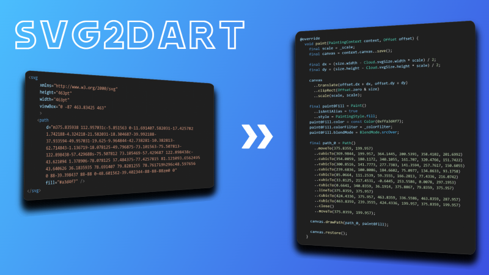

 # SVG to Dart Widget Converter 

`svg2dart` is a command-line tool that converts SVG files into pure Dart code. It generates performant Flutter widgets that use `LeafRenderObjectWidget` and a pre-recorded `ui.Picture` for rendering. 

This approach allows you to use your vector graphics directly in your Flutter application without runtime dependencies like `flutter_svg`, which can lead to better performance and a smaller dependency tree.

The conversion process is powered by the `vector_graphics_compiler` and `vector_graphics_codec` packages.



## Features
*   **Pure Dart code**: Generates widgets based on `LeafRenderObjectWidget` and a pre-recorded `ui.Picture`, minimizing runtime overhead.
*   **Optimizations**: Includes an optional `optimizations` flag that uses `pathops` for path simplification and `Tessellator` for direct GPU rendering.
*   **Core SVG Support**: Converts paths, fills, strokes, and basic gradients.
*   **Batch Processing**: Supports processing both single files and entire directories, preserving the source directory structure.
*   **`build_runner` Integration**: Automates code generation within your development workflow.

## Limitations

Currently, the tool does not support the following SVG features:
*   Raster images (`<image>`)
*   Advanced SVG features (like filters, patterns, etc.)


Files containing unsupported elements (like `<image>`) will be skipped during generation.

## Installation

To use `svg2dart` from the command line, install it globally using `pub`:

```bash
dart pub global activate svg2dart
```

## Usage

Once activated, you can use the `svg2dart` command from anywhere in your terminal.

```bash
svg2dart --input assets/icons/ --output lib/icons/
```

### Options

| Flag | Abbreviation | Description | Required |
|---|---|---|---|
| `--input` | `-i` | Path to the input SVG file or directory. | Yes |
| `--output` | `-o` | Path to the output directory. | Yes |
| `--optimizations` | | Enable optimizations (path simplification and tessellation). | No |
| `--help` | `-h` | Show this help message.| No |


## Alternative: Usage with `build_runner`

For automatic code generation that integrates with your development workflow, you can use `svg2dart` as a builder.

1.  **Add dependencies** to your project's `pubspec.yaml`:

    ```yaml
    dev_dependencies:
      build_runner: ^2.9.0 # or latest
      svg2dart: ^0.0.10 # or latest
    ```

2.  **Run the builder**:

    To generate the Dart files once:
    ```bash
    dart run build_runner build --delete-conflicting-outputs
    ```
    To watch for file changes and regenerate automatically:
    ```bash
    dart run build_runner watch --delete-conflicting-outputs
    ```

Here is an example of a `build.yaml` file that changes the default input and output directories:

```yaml
targets:
  $default:
    builders:
      svg2dart:
        options:
          # Default is "assets/svg"
          input: "assets/my_icons"
          # Default is "lib/generated/svg"
          output: "lib/generated/icons"          
```

## Using the Generated Widget

After generation, you can import the Dart file and use the widget like any other Flutter widget. You can override the original SVG dimensions by providing `width` and `height` properties.

You can see an example of a generated widget and its usage in the `example` directory of this repository.

```dart
import 'package:my_app/generated/icons/cloud.gen.dart';

class MyScreen extends StatelessWidget {
  @override
  Widget build(BuildContext context) {
    return const Scaffold(
      body: Center(
        // Use the generated widget with a custom size
        child: CloudSvg(
          width: 100,
          height: 100,
          colorFilter: ColorFilter.mode(Colors.yellow, BlendMode.srcIn)
        ),
      ),
    );
  }
}
```
